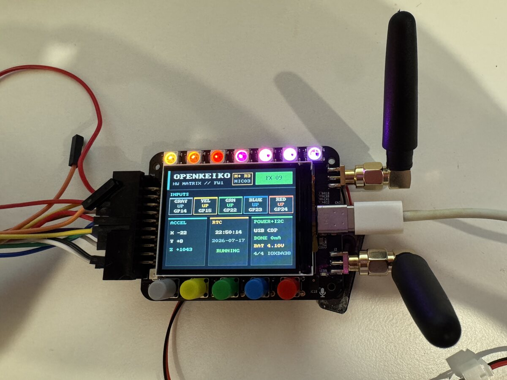

# OpenKeiko Firmware

<p align="center">
  
</p>

> [!WARNING]
> **This firmware is an alpha hardware-control demonstration.** It is incomplete, experimental, and not intended for production or unattended use.

OpenKeiko is an independent MicroPython firmware project for FW1 hardware. This alpha demonstrates control of the two RP2040 controllers, display, buttons, RGB LEDs, audio, onboard I2C peripherals, controller link, FPGA interface, and radio-related hardware.

Sub-GHz and infrared support is deliberately rudimentary:

- Sub-GHz support is experimental and receive-only. It provides basic radio setup, packet inspection, raw capture, and limited Princeton decoding.
- Infrared support provides basic NEC/NECext decoding, raw capture, saved-file handling, and guarded playback. It is not a complete universal remote implementation.

<p align="center">
  
</p>

## Hardware Documentation

The companion [`openkeiko-docs`](https://github.com/openkeiko/openkeiko-docs) repository contains the hardware overview, pinout, system architecture, peripheral references, and recovery documentation used alongside this firmware.

## Safety And Responsibility

Use this firmware entirely at your own risk. The OpenKeiko authors and contributors are not responsible for damaged devices, corrupted flash, lost data, battery or power-system problems, connected-hardware damage, radio or infrared interference, or any other direct or indirect loss resulting from building, flashing, deploying, modifying, or running this software.

Before proceeding:

- Back up both RP2040 flash devices and any files or settings you need to preserve.
- Expect a full MicroPython installation to replace existing firmware and initialize a new filesystem. The first boot can erase firmware, assets, files, and settings in the storage region.
- Verify the target controller serials before running deployment or flashing scripts.
- Keep the device powered reliably and do not disconnect it during a write.
- Review the scripts and source before allowing them to control attached hardware.
- Follow applicable radio regulations. The included Sub-GHz implementation does not transmit.

## Repository Layout

- `main/` contains the main-controller service, FPGA clock setup, main/display link, and receive-only radio support.
- `display/` contains the display dashboard, display-side peripherals, infrared handling, audio, RGB effects, and user interface.
- `common/` contains shared framed-link and watchdog helpers.
- `boards/FW1_16MB/` contains the 16 MiB MicroPython board definition.
- `examples/` contains receive-only Flipper-format sample files.
- `scripts/` contains build, deployment, maintenance, flashing, and host-analysis tools.
- `tests/` contains host-side regression tests.
- `vendor/` records licenses and provenance for included third-party components.

## Prerequisites

The scripts are intended to run from the repository root. Depending on the operation, the host needs:

- Git, Make, and Python 3
- [`uv`](https://docs.astral.sh/uv/getting-started/installation/), including its `uvx` command; this is required for device discovery, deployment, maintenance, flashing, and host tests
- `picotool` for the automated full-firmware workflow
- An ARM embedded GCC toolchain; `scripts/build.sh` can use Nix as a fallback when the detected compiler lacks Newlib
- A USB connection that exposes both RP2040 controllers

Install `uv` using its [official installation instructions](https://docs.astral.sh/uv/getting-started/installation/) and verify that `uvx` is available:

```sh
uvx --version
```

The hardware-management scripts use `uvx mpremote` so they can run the required MicroPython host tool without modifying the system Python installation.

Discover the connected MicroPython RP2040 serials:

```sh
./scripts/find-serials.sh
```

The two controllers expose identical USB descriptors, so enumeration alone cannot safely determine which serial belongs to the main or display controller. Verify each role, create the local configuration, and assign both values:

```sh
cp .env.example .env
```

```dotenv
FW1_MAIN_SERIAL=your-main-rp2040-serial
FW1_DISPLAY_SERIAL=your-display-rp2040-serial
```

`.env` is ignored by Git. Hardware-management scripts load it automatically. Values already exported in the shell take precedence over the file.

## Install On Existing MicroPython

If both controllers already run a compatible MicroPython build, deploy only the OpenKeiko applications and libraries:

```sh
./scripts/deploy.sh
```

The script places each watchdog into maintenance mode, deploys the main controller first and the display controller second, then restores watchdog supervision. This does not replace the underlying MicroPython firmware.

For a long interactive session, control watchdog maintenance explicitly:

```sh
./scripts/maintenance.sh display on
./scripts/maintenance.sh display off
```

Replace `display` with `main` when working on the main controller. Do not leave maintenance mode enabled after finishing.

## Build And Flash MicroPython

A full flash replaces the underlying firmware on both RP2040 controllers.

### 1. Build

```sh
./scripts/build.sh
```

The script checks out the pinned upstream MicroPython revision under `.deps/micropython/` and writes generated files under:

```text
.artifacts/micropython/build/FW1_16MB/
```

The UF2 image is:

```text
.artifacts/micropython/build/FW1_16MB/firmware.uf2
```

### 2. Flash From Running MicroPython

When both controllers already run MicroPython and `picotool` is available:

```sh
./scripts/flash.sh
```

The script flashes and verifies the display controller first and the main controller second. It enters each bootloader sequentially so two descriptor-identical RP2040 ROM devices are not presented at the same time.

After both controllers return, deploy the applications:

```sh
./scripts/deploy.sh
```

### 3. Manual UF2 Flashing

If the application is not running well enough for the automated script:

1. Disconnect USB from the device.
2. Hold the red button while reconnecting USB to expose the main controller's `RPI-RP2` volume.
3. Copy `firmware.uf2` to that mounted volume and wait for the controller to reboot.
4. Disconnect USB again.
5. Hold the blue button while reconnecting USB to expose the display controller's `RPI-RP2` volume.
6. Copy the same `firmware.uf2` to that volume and wait for reboot.
7. Run `./scripts/deploy.sh` after both MicroPython controllers enumerate normally.

The button-triggered `RPI-RP2` path is a write-only UF2 workflow and does not expose Picoboot. `picotool` is therefore not expected to attach through that recovery path.

## Testing

Run the host-side regression suite without installing packages globally:

```sh
uvx --from pytest pytest tests
```

Build products, dependency checkouts, test caches, and Python bytecode are intentionally excluded from version control. FPGA gateware, research material, captured artifacts, and device backups are maintained separately.

## References

- **Flipper Zero firmware:** The Flipper-compatible `.ir` and `.sub` file handling, preset terminology, and rudimentary Sub-GHz receive workflow are based on the public [`flipperdevices/flipperzero-firmware`](https://github.com/flipperdevices/flipperzero-firmware) repository. OpenKeiko's implementation is independent MicroPython code rather than a port, and compatibility remains limited. See the [Flipper provenance record](vendor/flipperzero-firmware/UPSTREAM.md).
- **ST7789 display support:** The included display driver and bitmap fonts are pinned from the MIT-licensed [`russhughes/st7789py_mpy`](https://github.com/russhughes/st7789py_mpy) project. See the [display-driver provenance record](vendor/st7789py_mpy/UPSTREAM.md) for the commit, source paths, and checksums.
- **RGB effects:** The MicroPython effects engine is an independent implementation inspired by the MIT-licensed [`kitesurfer1404/WS2812FX`](https://github.com/kitesurfer1404/WS2812FX) project and FastLED's [`Pride2015`](https://github.com/FastLED/FastLED/blob/master/examples/Pride2015/Pride2015.ino) example. See the [RGB-effects provenance record](vendor/rgb-effects/UPSTREAM.md).

## Independence

OpenKeiko is an independent community effort. It is not affiliated with, endorsed by, or sponsored by the original device project, its creators, or its maintainers. Product names and trademarks belong to their respective owners.
